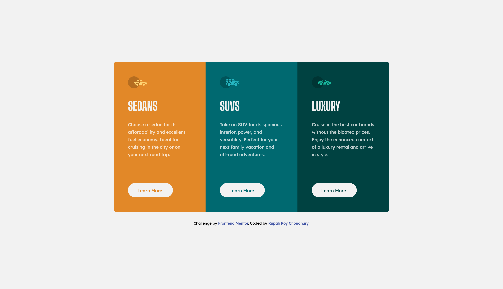
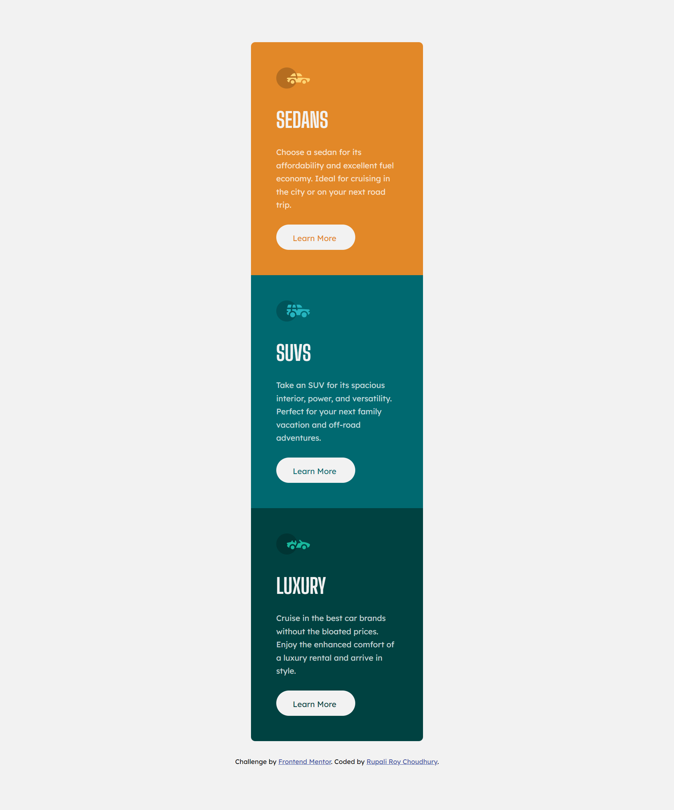
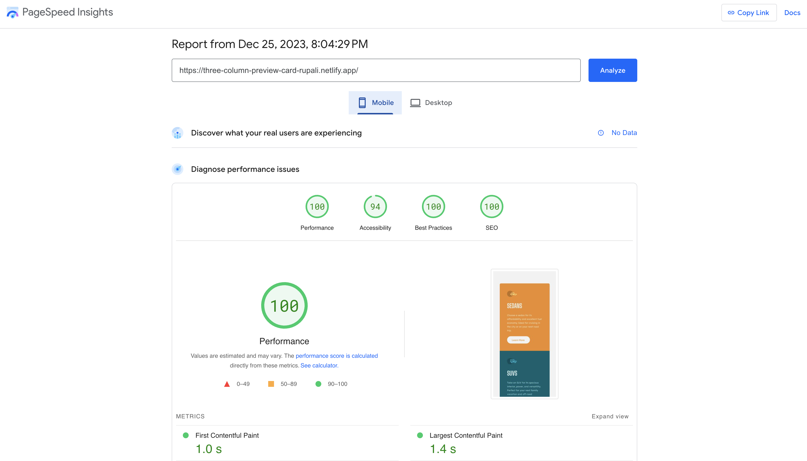
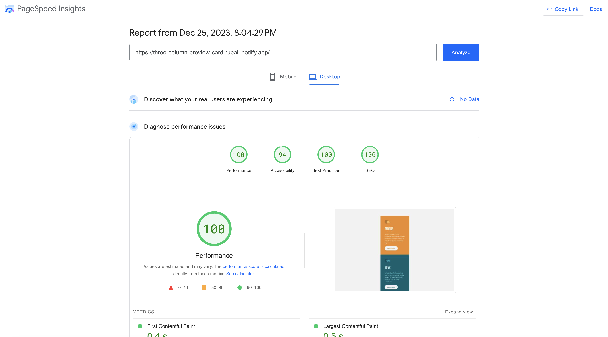

# Frontend Mentor - 3-column preview card component solution

This is a solution to the [3-column preview card component challenge on Frontend Mentor](https://www.frontendmentor.io/challenges/3column-preview-card-component-pH92eAR2-). Frontend Mentor challenges help you improve your coding skills by building realistic projects. 

## Table of contents

- [Overview](#overview)
  - [The challenge](#the-challenge)
  - [Screenshots](#screenshots)
  - [PageSpeed Insights results](#pagespeed-insights-results)
  - [Links](#links)
- [My process](#my-process)
  - [Built with](#built-with)
  - [Tested with](#tested-with)
  - [What I learned](#what-i-learned)
  - [Continued development](#continued-development)
  - [Useful resources](#useful-resources)
- [Author](#author)
- [Acknowledgments](#acknowledgments)

## Overview

### The challenge

Users should be able to:

- View the optimal layout depending on their device's screen size
- See hover states for interactive elements

### Screenshots





### PageSpeed Insights results
[Mobile version](https://pagespeed.web.dev/analysis/https-three-column-preview-card-rupali-netlify-app/ovfjmkq240?form_factor=mobile)



[Desktop version](https://pagespeed.web.dev/analysis/https-three-column-preview-card-rupali-netlify-app/ovfjmkq240?form_factor=desktop)



### Links

- Solution URL: [Three column preview card component github](https://github.com/rupali317/3-column-preview-card-component-main)
- Live Site URL: [Three column preview card component challenge live](https://three-column-preview-card-rupali.netlify.app/)

## My process

### Built with

- Semantic HTML5 markup
- CSS custom properties
- Flexbox
- Mobile-first workflow
- [React](https://reactjs.org/) - JS library for writing reusable components
- [SCSS](https://sass-lang.com/) - For styling

### Tested with

- [React Testing Library](https://testing-library.com/docs/react-testing-library/intro/) - React Testing Library helps test React components to make sure they work as expected when users interact with them.
- AXE Dev Tools -  allows to perform automated accessibility testing on React components 
- Browsers used for testing: Google Chrome, Firefox, Safari, Brave, Microsoft Edge
- Devices: 
  - (Real) MacBook Pro (15 inch), Samsung Galaxy A33 5G, Samsung Galaxy S20+
  - (Virtual) The mobile and tablet devices mentioned under Chrome's dev console

### What I learned

- Ouline in CSS is for the line outside the element's border. It does not affect the layout as it does not take up space. There were scenarios where using border for one state and  not using for the other state led to change of the button's height since border is considered part of border-box. Utilising outline did not cause the chanhge in button's height.
- Sometimes using role attribute for a link tag can be better than using the native button tag. For insatnce, lear more typically navigates one to a new section or page. Using link can enhance the SEO wherereas button is not considered for indexing and thus does not contribute to the SEO

```html
<a
      role="button"
      aria-label={"Learn more about " + props.title}
      href="#main"
    >
      learn more
    </a>
```

- It is better to make border radius, border width, box shadow in rem for visual purpose. Otherwise buttons can appear rectangular instead of rounded when the browser's font setting is altered to a higher value
```css
/* Borders */
$border-radius-none: 0px;
$border-radius-soft: 0.5rem; /* 8px */
$border-radius-rounded: 1.5625rem; /* 25px; */
$border-size-s: 0.125rem; /* 2px */
$border-size-m: 0.25rem; /* 4px */

/* Box shadows */
$box-shadow-action-focus: 0rem 0rem 0rem 0.25rem $neutral-white-color-opacity-2;
```
- When aria-label is used, the screen reader reads the aria-label and not the text content of the tag. Hence, it is imperative to write descrpetive value for aria-label
- Outline is rectangular in Safari, hence instead of outline, I resorted to the usage of box-shdow
```css
&:focus {
      @extend %link-pseudo-class-definitions;
      box-shadow: $box-shadow-action-focus;
      outline: none;
    }

    &:focus-visible {
      @extend %link-pseudo-class-definitions;
      box-shadow: $box-shadow-action-focus;
      outline: none;
    }
```
- Learnt how :focus-visible is different from :focus. The former indicates that the focus is coming from non-mouse input like keyboard. :focus is mainly for mouse input.

### Continued development

Use this section to outline areas that you want to continue focusing on in future projects. These could be concepts you're still not completely comfortable with or techniques you found useful that you want to refine and perfect.

**Note: Delete this note and the content within this section and replace with your own plans for continued development.**

### Useful resources

- [Fixing focus for Safari](https://itnext.io/fixing-focus-for-safari-b5916fef1064?gi=842cad91af3c#:~:text=The%20reason%20is%20that%20macOS,of%20with%20their%20competitors) - If anyone is wondering why the focus state is not working in Safari, it is because they do not want to support it for links and buttons so that they remain consistent with the operating system

## Author

- Website - [Rupali Roy Choudhury](https://www.linkedin.com/in/rupali-rc/)
- Frontend Mentor - [@rupali317](https://www.frontendmentor.io/profile/rupali317)

## Acknowledgments

I express my gratitude towards my mentor - Deborah for the insightful code review session
